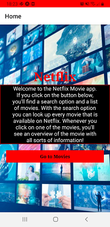
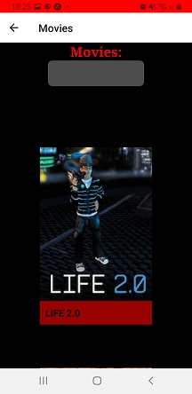
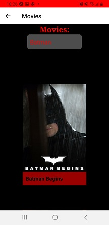
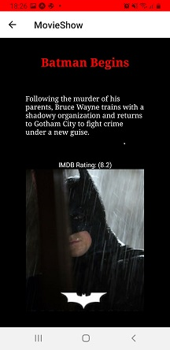

<h1>Installatiehandleiding</h1>

<h2>Inleiding</h2>
This mobile application gives you the option to search up any movie available on Netflix.
You can then click on the movie to get an overview that shows the imdbrating and a short
synopsis of the movie.

<h3>Requirements</h3>

- A clean computer/laptop/phone
- For this application to run you will need an IDE like Webstorm.
- Install Node.js and NPM. You can follow the instructions here -> (https://www.npmjs.com/get-npm)
- Install `npm install --unsafe-perm -g expo-cli`
- Make a free account in the Expo Client -> (https://expo.io/signup)  
- Install `Expo Go` on your phone in the App/Play store -> (https://expo.io/tools#client)
- Install the following dependencies: `npm install axios`, `npm install @react-navigation/native`, 
  `expo install react-native-gesture-handler react-native-reanimated react-native-screens react-native-safe-area-context @react-native-masked-view/masked-view`
  `npm install @react-navigation/stack`  
- Make sure that your phone and laptop/computer are connected to the same network.  
  
<h3>Start up</h3>

1. To start the application, go to the terminal at the bottom of your IDE. In the terminal type in either: `npm start` or `expo start`
   to launch the application.
2. You will see the Homepage with information about the application. You can there press on the `Go to Movies` button. See picture below:
  
   
3. Once you pressed on the button, you'll arrive at the page where you can search for a movie by typing in which
   movie you want to see. See picture below:
   
   
4. You can now click on one of the movies that appeared on your screen. See picture below:
   
   
5. Once you pressed on a movie, you'll arrive at the page where you see a small overview of the movie.
   This includes the imdbrating and a small synopsis of the movie. See picture below:
   
    

<h3>CSS</h3>

The CSS that has been used for styling is flexbox.
